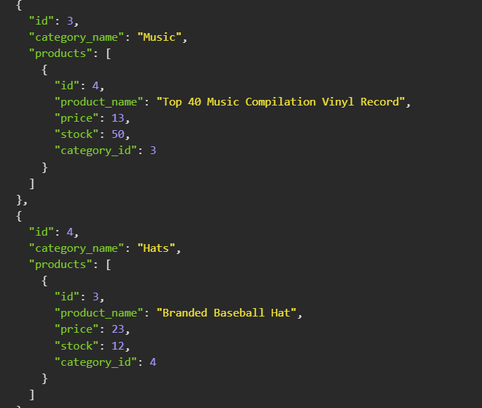

# Performing CRUD operations on an E-commerce database.   

In this project, I was approached to build the backend of an e-commerce site. The client wanted it so that it would be easy and intuitive to perform all the CRUD operations on the MySQL database that held all the product, category and tag information. 

To achieve this, I took advantage of the sequelize package and all the functionality it offers, particularly the 'belongsTo', 'hasMany' and 'belongsToMany' which meant that just one http request could get or update mulitiple models. 

To protect the users login credentials I also used the dotenv package.

## Table of Contents

[Installation](#installation)

[Usage](#usage)

[Contributing](#contributing)

[License](#license)

[Questions](#questions)

[Links](#links)

## Installation

To install this you will need to run: 'npm install' on the command line

## Usage

To start you will need to first login to MySQL using the 'mysql -u root -p' command in the command line. Once logged in you will then have to do 'source db/schema.sql' to create the e-commerce_db schema in MySQL. This will need to be seeded by logging out of MySQl and doing 'npm run seed' in the command line, before starting the server up with 'npm start'.

## Contributing

To contribute to this, clone the repo locally and commit on a seperate branch

## License

This application is covered under the following license: The Unlicence

## Links

I have created a walkthrough video that dem onstrates the functionality of the application which can be viewed by [clicking here](https://drive.google.com/file/d/1MZm3tgUkhsb--r_yiVh--bjyxMw998ji/view)

